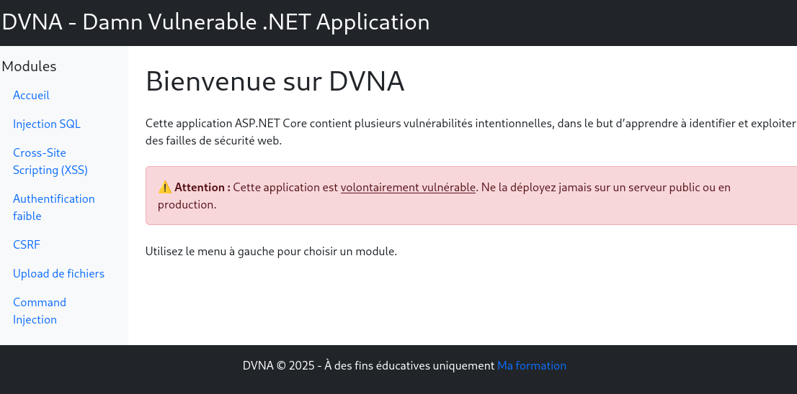

# DVNA

DVNA est un projet C# conçu pour apprendre le pentest et tester la sécurité des applications.

## Fonctionnalités

- Application vulnérable pour la pratique du pentest
- Scénarios de tests de sécurité automatisés
- API et interface web pour l'exploration des failles



## Prérequis

- .NET 6 ou supérieur
- [Autres dépendances éventuelles]

## Installation

```bash
git clone https://github.com/votre-utilisateur/dvna.git
cd dvna
dotnet restore
```

## Utilisation

```bash
dotnet run
```

## Structure du projet

```
dvna/
├── src/
├── tests/
├── README.md
└── ...
```

## Contribution

Les contributions sont les bienvenues ! Veuillez ouvrir une issue ou soumettre une pull request.

## Licence

Ce projet est sous licence [Nom de la licence].

